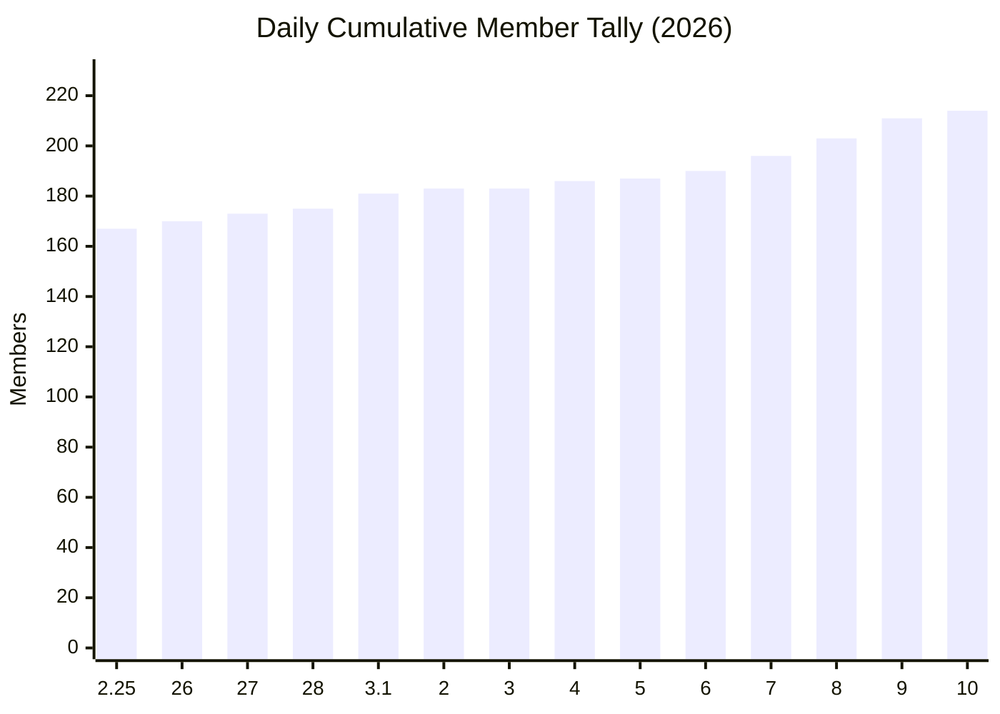

# Daily Cumulative Member Tally (2026)

Data approach:
- One end-of-day cumulative value per date.
- Missing calendar dates are carry-forward values from the previous day.
- Label format uses numeric month.day when the month changes, otherwise day only.
