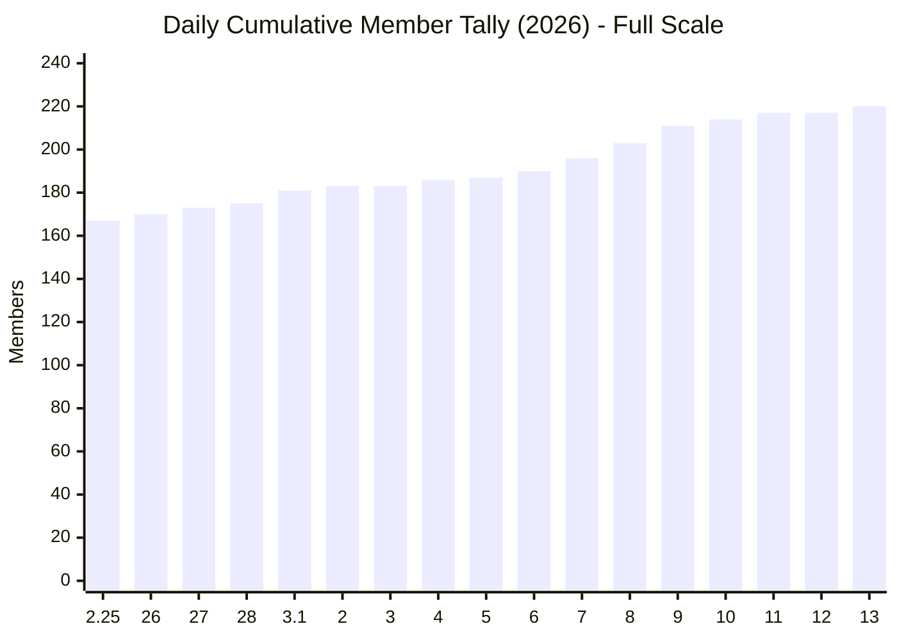
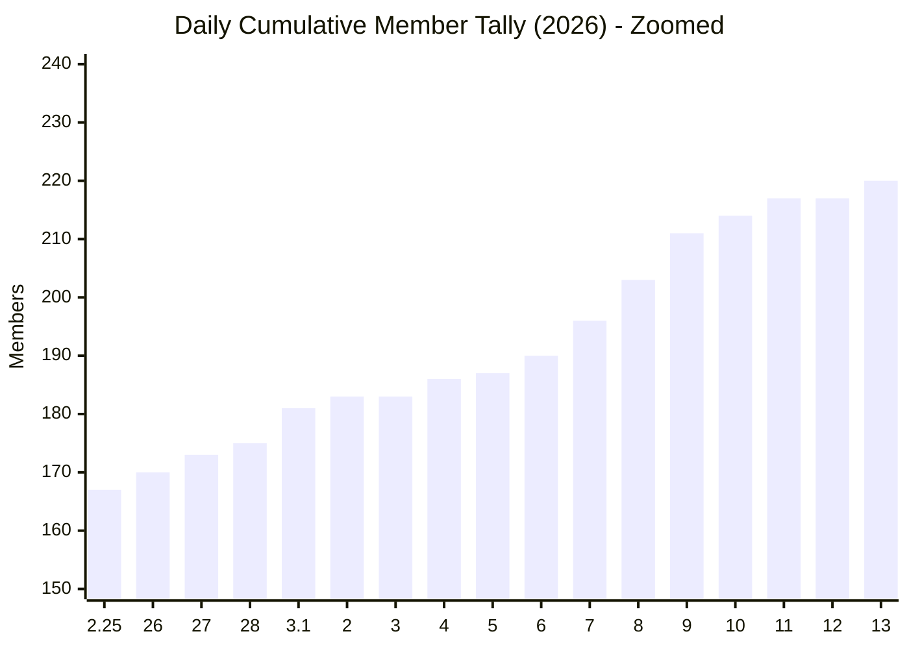
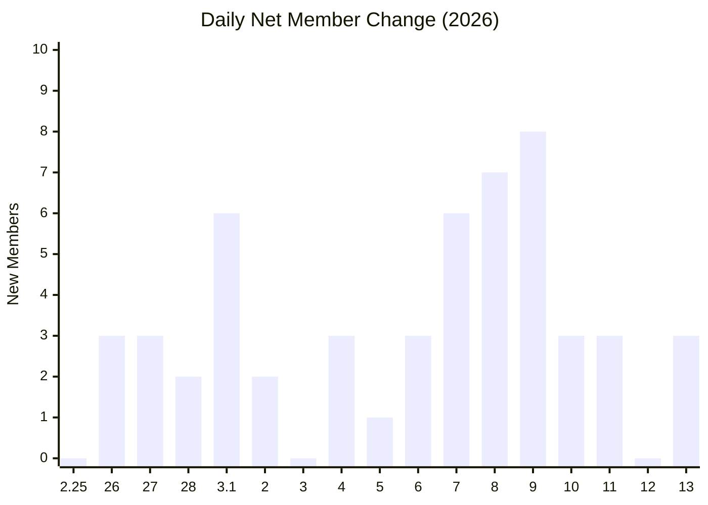

# Daily Cumulative Member Tally (2026)

## 1) Cumulative (Full Scale)

## 2) Cumulative (Zoomed)

## 3) Daily Net Change

Data approach:
- One end-of-day cumulative value per date.
- Missing calendar dates are carry-forward values from the previous day.
- Label format uses numeric month.day when the month changes, otherwise day only.
- Daily net change is the day-over-day difference from the cumulative series.
